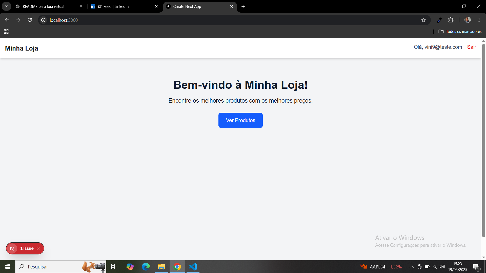
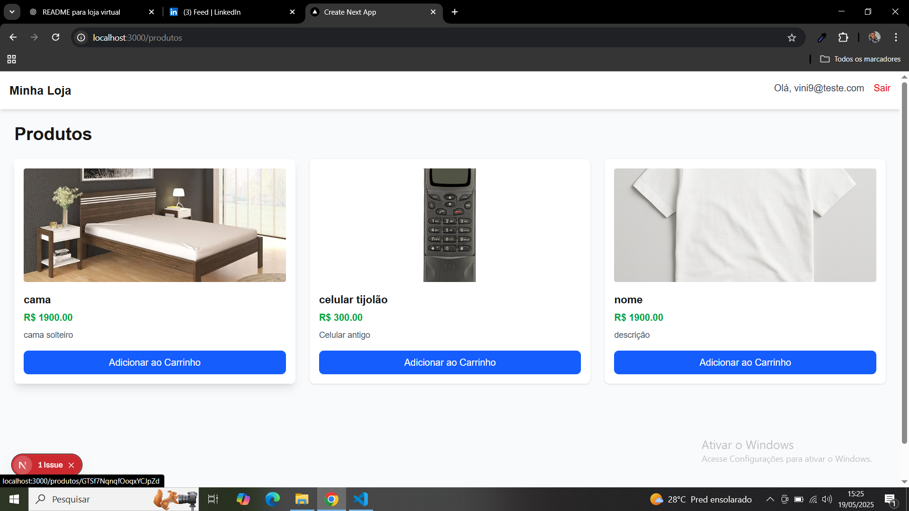
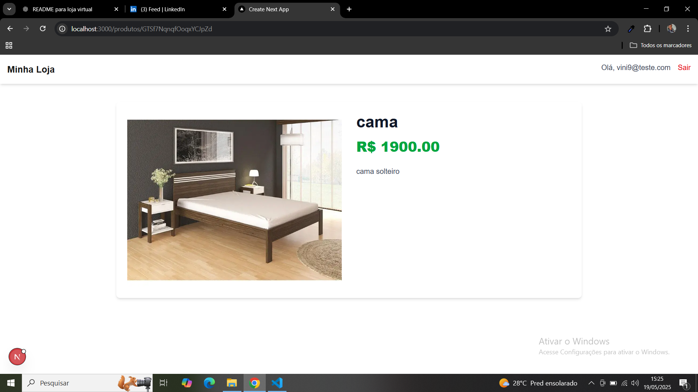
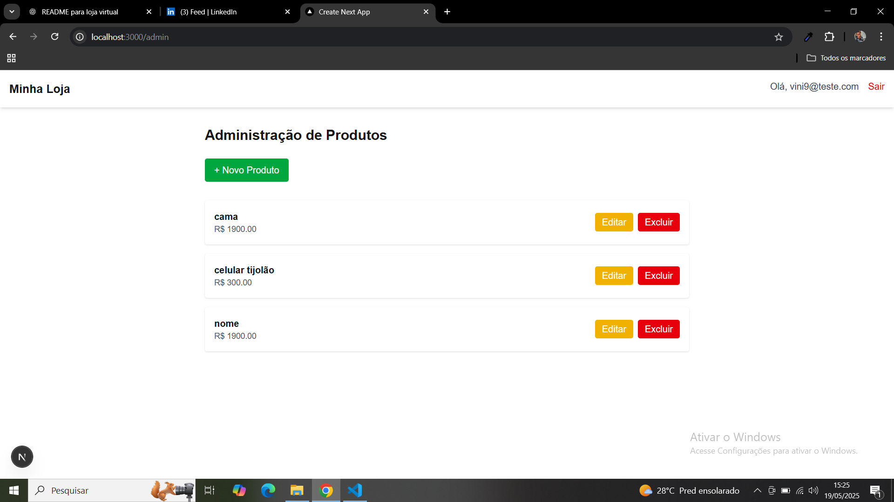

# 🛒 Loja Virtual

Projeto de uma loja virtual desenvolvido com Next.js e Firebase, com foco em uma experiência completa de e-commerce, incluindo listagem de produtos, carrinho de compras e integração com banco de dados em tempo real.

## 🚀 Funcionalidades

- Listagem de produtos a partir do Firebase
- Adição e remoção de itens no carrinho
- Cálculo automático do valor total
- Página de checkout
- Design responsivo
- Estrutura otimizada com diretório `app` (Next.js)

## 🧪 Tecnologias utilizadas

- [Next.js (App Router)](https://nextjs.org/)
- [TypeScript](https://www.typescriptlang.org/)
- [Firebase (Firestore)](https://firebase.google.com/)
- [Tailwind CSS](https://tailwindcss.com/) (ou especifique o framework de estilo que você usou)
- [React Context API](https://reactjs.org/docs/context.html) para gerenciamento de estado do carrinho

## 📸 Screenshots

### 🏠 Tela Home


### 🎮 Jogo de Ponga (2 Jogadores)


### 🤖 Modo IA (em breve)


### 🤖 Modo IA (em breve)


## 📦 Como rodar o projeto

```bash
# Clone o repositório
git clone https://github.com/vinisantos2/loja-virtual

# Acesse a pasta do projeto
cd loja-virtual

# Instale as dependências
npm install

# Crie um arquivo .env.local com suas credenciais do Firebase
touch .env.local
